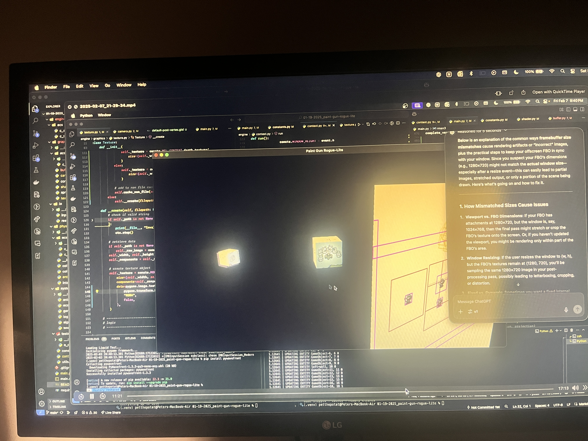
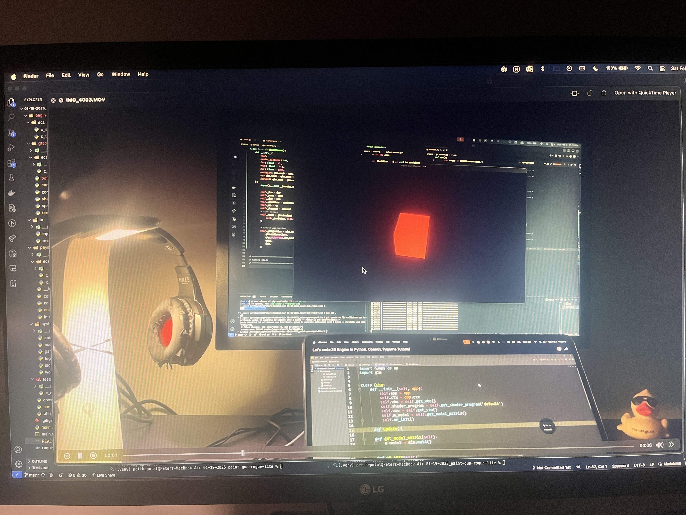

# 01-19-2025 - Paint Gun Rogue-Lite

Welcome to game devevelopment with Peter! Today we will be coding the greatest game to ever walk the earth. Walk. No.. more like `ink` the earth haha... yeah its an ink game. **Splatoon** but better and rogue-lite and with **teleportation** because that's always nice.

Also...

We've got anime based lore lol. That's good right? Kinda like `Wistoria` but **ink** and **squids** and *gun** and **teleport**.


## How to Run?

You don't. Yet.

Requirements:

- Python 3.11.0
- everything in requirements.txt

```bash
pip install -r requirements.txt
```


## Development Log

I should start a YouTube series for this if I want to get anywhere.

## Images

Hey. Here are some images of my work so far.







